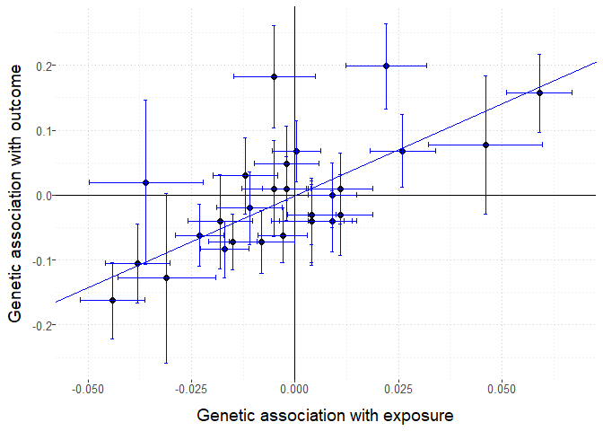
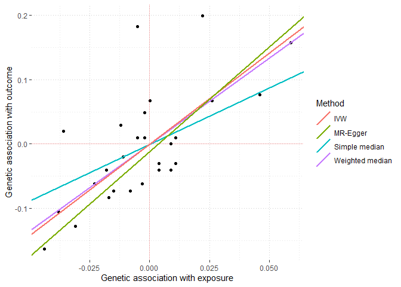

<!-- README.md is generated from README.Rmd. Please edit that file -->
<!-- badges: start -->

[](https://github.com/amymariemason/MR/actions/workflows/r.yml)
[](https://CRAN.R-project.org/package=MendelianRandomization)

<!-- badges: end -->

The MendelianRandomization R package provides a comprehensive set of
methods for performing Mendelian randomization analyses with summarized
data. We include methods for both single exposure (univariable) and
multiple exposure (multivariable) analyses, as well as options to
account for correlated variants in several methods.

Summarized data on genetic associations with traits and diseases from
large consortia can be accessed using websites such as
[PhenoScanner](http://www.phenoscanner.medschl.cam.ac.uk/) and the [GWAS
catalog](https://www.ebi.ac.uk/gwas/). These data can be used to obtain
causal estimates following the Mendelian randomization paradigm. For an
overview of this approach, see
[here](https://www.mendelianrandomization.com/index.php/what-is-mr) for
links to explanations and examples.

## Installation

``` r
# Install released version from CRAN
install.packages("MendelianRandomization")
```

## Usage

If you are just getting started with Mendelian randomization, we
recommend following the brief example analysis below, and then working
through the package component vignettes, starting with the [data input
vignette](articles/Data_Input.html).

## Bugs and Feedback

If you encounter any issues, bugs, or have suggestions for improvements
for our R package, please report to the package maintainer [Stephen
Burgess](mailto:sb452@medschl.cam.ac.uk).

We are keen to include further summarized data Mendelian randomization
methods in our package, and any other customized code that you want to
share with others. You can [fork the package from
Github](https://github.com/cran/MendelianRandomization) to test for
compatibility with the existing package.

## Example analysis

This is an example analysis to investigate lipid effects on coronary
artery disease risk using the example data included with the package.

``` r
library(MendelianRandomization) # load package

MRInputObject <- mr_input(bx = ldlc, 
                          bxse = ldlcse, 
                          by = chdlodds, 
                          byse = chdloddsse)
```

The variables *ldlc*, *hdlc*, *trig*, and *chdlodds* are the genetic
associations with (respectively) LDL-cholesterol, HDL-cholesterol,
triglycerides, and coronary heart disease (CHD) risk for 28 genetic
variants reported by Waterworth et al (2010). The respective standard
errors of the associations are given as *ldlcse*, *hdlcse*, *trigse*,
and *chdloddsse*.

### Perform inverse-variance weighted method

We can use this package to perform a two-sample Mendelian Randomization
analysis using a wide variety of methods. Here we show the
inverse-weighted variance method:

``` r
MRAllObject_ivw <- mr_ivw(MRInputObject) # perform IVW method

MRAllObject_ivw  # view results
#> 
#> Inverse-variance weighted method
#> (variants uncorrelated, random-effect model)
#> 
#> Number of Variants : 28 
#> 
#> ------------------------------------------------------------------
#>  Method Estimate Std Error 95% CI       p-value
#>     IVW    2.834     0.530 1.796, 3.873   0.000
#> ------------------------------------------------------------------
#> Residual standard error =  1.920 
#> Heterogeneity test statistic (Cochran's Q) = 99.5304 on 27 degrees of freedom, (p-value = 0.0000). I^2 = 72.9%. 
#> F statistic = 28.0.

mr_plot(MRInputObject, line="ivw", interactive = FALSE) # plot results
```



### Alternative analysis methods

To assess the robustness of our results, we can perform other methods,
such as the MR-Egger and weighted median methods:

``` r
MRAllObject <- mr_allmethods(MRInputObject, method="main") # perform MR-Egger and median methods

MRAllObject  # view results
#>           Method Estimate Std Error 95% CI        P-value
#>    Simple median    1.755     0.740   0.305 3.205   0.018
#>  Weighted median    2.683     0.419   1.862 3.504   0.000
#>              IVW    2.834     0.530   1.796 3.873   0.000
#>         MR-Egger    3.253     0.770   1.743 4.762   0.000
#>      (intercept)   -0.011     0.015  -0.041 0.018   0.451

mr_plot(MRAllObject) # plot results
```



For more methods, see the vignettes on
[univariable](articles/Univariable_MR_Methods.html) and
[multivariable](articles/Multivariable_MR_Methods.html) methods.
